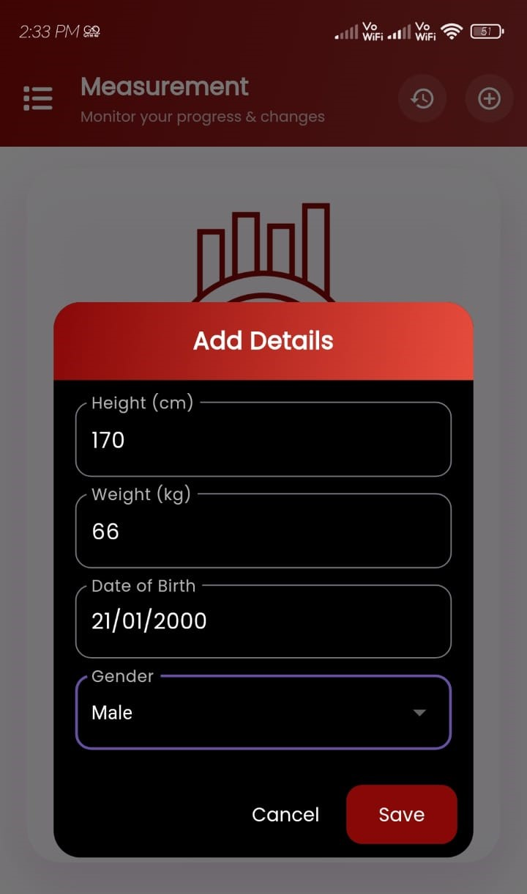
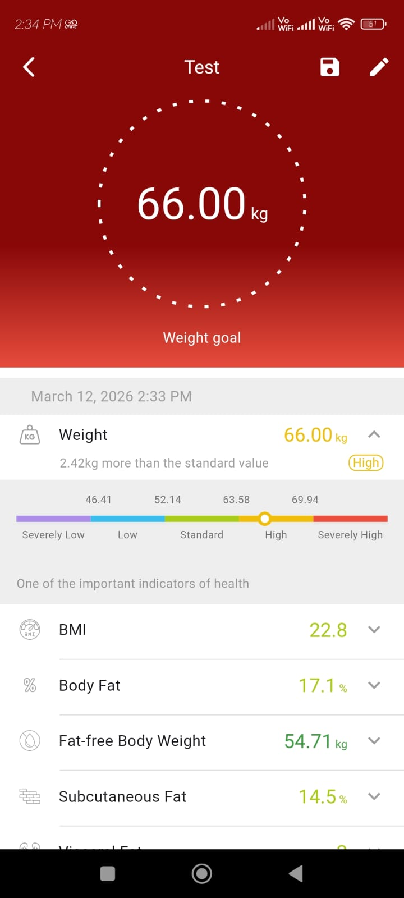
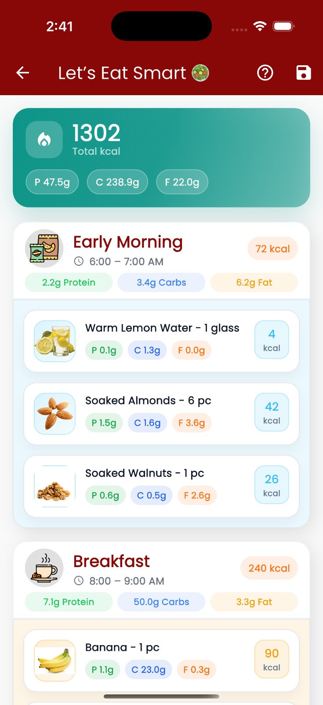
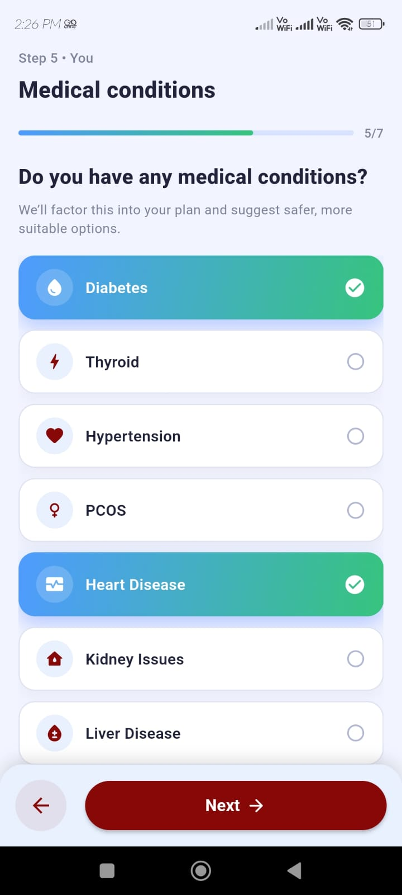

# AI Health Analyzer

**AI Health Analyzer** is a smart health and nutrition application built with **Flutter**. It calculates body composition metrics similar to a smart scale and generates **personalized diet charts** using structured nutrition data and AI.

The app collects user inputs such as **height, weight, age, gender, goal, activity level, allergies, health conditions, and dietary preferences** to generate a tailored diet plan.

---

# Features

## Body Metrics Calculation

Calculates important health indicators:

* **BMI (Body Mass Index)**
* **BMR (Basal Metabolic Rate)**
* **Body Fat Percentage**

All calculations are implemented in a dedicated **BodyComposition class** for modular health computations.

---

## Personalized Diet Planning

Generates diet charts based on:

* User health profile
* Dietary preferences
* Allergies and restrictions
* Fitness goals

Diet plans are created using **structured local JSON nutrition data** and can optionally be enhanced using **Scaleway AI**.

---

## Structured Meal Planning

Meals are organized into daily **time slots**:

* `early_morning`
* `breakfast`
* `lunch`
* `dinner`

Each meal contains foods assigned to specific **nutritional roles**, such as:

* `light_start`
* `protein_main`
* `starch_bowl`
* `hydration`

This **slot-and-role structure** helps create balanced meals and maintain proper macronutrient distribution throughout the day.

---

## Smart Food Data Model

Food items are stored in structured **JSON format** containing:

* Nutritional values
* Portion ranges
* Meal roles
* Dietary tags (veg, vegan, energy_dense)
* Health restrictions and allergens

This allows the system to intelligently filter foods and generate personalized meal plans.

---

# Tech Stack

* **Flutter**
* **Dart**
* **Local JSON Dataset**
* **Scaleway AI (optional)**

---

# Screenshots

| User Input | Calculated Body Metrics |
|------------|-----------------------|
|  |  |

| Generated Diet Plan | Medical Conditions |
|---------------------|--------------|
|  |  |

---

# Project Setup

### 1. Clone the Repository

```bash
git clone https://github.com/Sawant-Raj/ai-health-analyzer.git
```

### 2. Navigate to Project Folder

```bash
cd ai-health-analyzer
```

### 3. Install Dependencies

```bash
flutter pub get
```

### 4. Run the App

```bash
flutter run
```

### Requirements

* Flutter installed
* Android Studio / VS Code
* Emulator running or physical device connected

---

# Project Architecture

The project follows a **modular structure** separating UI, logic, and AI services.

```
root
|
├── screenshots
│
├── assets
│   └── meals2.json
│
├── images
│
├── lib
│   ├── ai
│   │   ├── screens
│   │   └── services
│   │
│   ├── core
│   │
│   ├── data
│   │
│   ├── screens
│   │
│   ├── smart_scale
│   │
│   └── main.dart
│
└── pubspec.yaml
```

### Main Modules

**AI (`lib/ai`)**
Handles AI diet generation and Scaleway integration.

**Core (`lib/core`)**
Shared utilities for nutrition calculations, tag filtering, and user preferences.

**Data (`lib/data`)**
Meal planning engine and slot templates used to generate diet plans.

**Screens (`lib/screens`)**
UI screens for collecting user health data and displaying meal plans.

**Smart Scale (`lib/smart_scale`)**
Implements body composition calculations and dashboard.

---

# License

This project is for **educational and demonstration purposes**.
